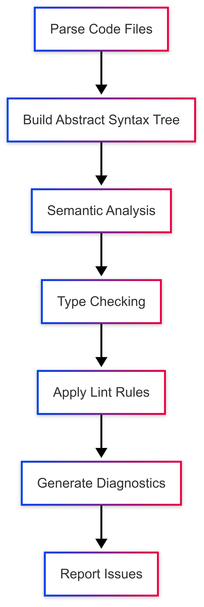

# দ্য কোড ডিটেকটিভস: Static Analysis ইন Dart

## ভূমিকা: পরিচিত হন আমাদের কোড ডিটেকটিভদের সাথে  

ফ্রাস্ট্রেশনে নিজের চুলে হাত বোলাতে বোলাতে পিপিটি চেয়ারে হেলান দিল। "ঘণ্টার পর ঘণ্টা ধরে এই ইস্যুটি debugging করছি! কোড ঠিকঠাক compile হচ্ছে, কিন্তু production-এ গিয়ে কিছু একটা সমস্যা হচ্ছেই।"

তার mentor এবং senior developer রাগিব অভিজ্ঞতার হাসি হাসলেন। "শুনে মনে হচ্ছে এই কেসে তোমার একজন ভালো detective দরকার। তুমি কি static analysis পুরোপুরি ব্যবহার করে দেখেছো?"

"static কী?" পিপিটি জিজ্ঞেস করলো।

"static analysis," রাগিব ব্যাখ্যা করলেন। "এটাকে এভাবে ভাবো যে, তোমার কোড রান করার আগেই একজন খুঁতখুঁতে detective সেটা পরীক্ষা করছে, সম্ভাব্য সমস্যাগুলো ধরছে এবং best practices অনুসরণ করতে বাধ্য করছে।"

## Static Analysis কী এবং আপনার এটি কেন প্রয়োজন

"চলো তোমাকে একটা বাস্তব উদাহরণ দেখাই," পিপিটির স্ক্রিনের দিকে ইশারা করে রাগিব বললেন। "এই লাইনটা দেখো? `if (userType = 'admin') { ... }`"

পিপিটি মাথা নাড়লো। "এটা দেখছে যে user admin কিনা।"

"আসলে, এটা কিছুই check করছে না—এটা userType-এ 'admin' assign করছে," রাগিব বোঝালেন। "তুমি comparison-এর জন্য == চেয়েছিলে, assignment-এর জন্য = নয়। static analysis এই ধরনের নীরব সমস্যাগুলিই-দের ধরে দেয়।"

"এটা একটা সাধারণ ভুল যা বড় ধরনের সমস্যা তৈরি করতে পারে," পিপিটি বুঝতে পারলো। "কিন্তু static analysis আসলে কাজ করে কীভাবে?"

"কল্পনা করো একজন detective-এর যে Dart কোডের সব নিয়ম জানে," রাগিব শুরু করলেন। "এই detective—আমাদের static analyzer—তোমার কোড execute না করেই সেটা পড়ে, সেটা কী কাজ করে তার একটা mental model তৈরি করে এবং bug বা খারাপ practice নির্দেশ করতে পারে এমন pattern খুঁজে বের করে।"

## Static Analysis কিভাবে কাজ করে

<div style="display: flex; gap: 15px; align-items: flex-start;">

<div style="flex: 1; text-align: center;">
  
  <br/>
  <em>Fig: Simple Static Analysis Flowchart </em>
</div>

<div style="flex: 1; text-align: center;">
  
  <br/>
  <em>Fig: Static Analysis Workflow</em>
</div>

</div>

১. **Parse the Code (কোড পার্স করা)**: Analyzer আপনার .dart ফাইলগুলো পড়ে এবং তাদের গঠন বোঝে।  
২. **Build an Abstract Syntax Tree (AST) (একটি অ্যাবস্ট্রাক্ট সিনট্যাক্স ট্রি (AST) তৈরি করা)**: এটি আপনার কোডের একটি ট্রি representation তৈরি করে।  
৩. **Semantic Analysis (সিমান্টিক অ্যানালাইসিস)**: এটি টাইপ পরীক্ষা করে, নাম সমাধান করে এবং সম্পর্কগুলো বোঝে।  
৪. **Type Checking (টাইপ চেকিং)**: এটি যাচাই করে যে টাইপগুলো মিলে যাচ্ছে এবং অপারেশনগুলো বৈধ কিনা।  
৫. **Apply Lint Rules (লিন্ট রুল প্রয়োগ করা)**: এটি কনফিগার করা স্টাইল এবং best practice রুলগুলোর সাথে কোড পরীক্ষা করে।  
৬. **Generate Diagnostics (ডায়াগনস্টিক তৈরি করা)**: এটি সমস্ত সমস্যা reportable ফরম্যাটে কম্পাইল করে।  
৭. **Report Issues (সমস্যা রিপোর্ট করা)**: এটি IDE বা কমান্ড লাইনের মাধ্যমে ডেভেলপারের কাছে সমস্যাগুলো উপস্থাপন করে।

রাগিব ব্যাখ্যা করলেন, "এটা অনেকটা আপনার দলের সবচেয়ে খুঁতখুঁতে সহকর্মীর কাছ থেকে কোড রিভিউ পাওয়ার মতো। এমন একজন যে কখনই ক্লান্ত হয় না বা কিছু মিস করে না।"

## টিম চ্যালেঞ্জ: কনসিস্টেন্সি বজায় রাখা

যেমনি রাগিব তার ব্যাখ্যা শেষ করলেন, আরও তিনজন ডেভেলপার তাদের সাথে মিটিং রুমে যোগ দিলেন। মাশরাফি অথেন্টিকেশন মডিউলে কাজ করছিলেন, মেহরাজ পেমেন্ট প্রসেসিং নিয়ে কাজ করছিলেন এবং রাফি অ্যানালিটিক্স ড্যাশবোর্ড তৈরি করছিলেন।

"একেবারেই সঠিক সময়," রাগিব বললেন। "আমরা এইমাত্র static analysis নিয়ে আলোচনা করছিলাম।"

"ওহ, আমি আসলে এটা নিয়ে কথা বলতে চাচ্ছিলাম," মাশরাফি বললেন। "আমি লক্ষ্য করেছি যে সবার কোড বেশ আলাদা দেখাচ্ছে। মেহরাজ `?` অপারেটর সহ অনেক nullable type ব্যবহার করে, রাফি exception throw করতে পছন্দ করে এবং পিপিটি ডিফল্ট মান ব্যবহার করতে থাকে। এর ফলে একে অপরের কোড রিভিউ করা যতটা সহজ হওয়া উচিত তার চেয়ে বেশি জটিল হয়ে যাচ্ছে।"

মেহরাজ মাথা নেড়ে সায় দিলেন। "আর আমি লক্ষ্য করেছি যে আমাদের মধ্যে কেউ কেউ ফাইলের নামের জন্য snake_case ব্যবহার করে আবার কেউ camelCase। ফাইল খুঁজে বের করা কঠিন হয়ে যাচ্ছে।"

"ঠিক এই কারণেই টিম প্রোজেক্টে static analysis আরও বেশি মূল্যবান," রাগিব ব্যাখ্যা করলেন। "যখন একাধিক ডেভেলপার একসাথে কাজ করে, তখন সামঞ্জস্য বজায় রাখা এবং একই প্যাটার্ন অনুসরণ করা অত্যন্ত গুরুত্বপূর্ণ হয়ে ওঠে।"

রাফি বললেন, "গত সপ্তাহে আমি ঘণ্টার পর ঘণ্টা ধরে বোঝার চেষ্টা করছিলাম কেন একটা ফিচার কাজ করছে না, পরে জানতে পারলাম কেউ একজন non-nullable type ব্যবহার করেছে যেখানে আমাদের null value হ্যান্ডেল করার দরকার ছিল। একটা consistent approach থাকলে এটা এড়ানো যেত।"

"ঠিক এখানেই static analysis সত্যিই প্রয়োজনীয়," রাগিব বললেন। "`analysis_options.yaml` ফাইল কনফিগার করে এবং আমাদের রিপোজিটরিতে কমিট করার মাধ্যমে, আমরা নিশ্চিত করি যে সবাই একই স্ট্যান্ডার্ড অনুসরণ করবে—কে কোড লিখেছে বা কখন লিখেছে তা বিবেচ্য নয়।"

পিপিটি আগ্রহী হয়ে উঠলো। "তাহলে এটা কি এমন একটা shared rulebook-এর মতো যা পুরো টিম মেনে চলতে রাজি?"

"অবশ্যই," রাগিব উত্তর দিলেন। "আর সবচেয়ে ভালো দিকটা কী? এটা automated। নিয়মগুলো টুলস দ্বারা প্রয়োগ করা হয়, কোড রিভিউ করার সময় কেউ ম্যানুয়ালি চেক করে না।"

## Dart-এ Static Analysis কীভাবে ব্যবহার করবেন

"এটা তো বেশ কাজের মনে হচ্ছে," পিপিটি স্বীকার করলো। "আমি এটা ব্যবহার করা শুরু করব কীভাবে?"

"সুখবর! তুমি ইতিমধ্যেই কিছুটা হলেও এটা ব্যবহার করছো," রাগিব হেসে বললেন। "Dart SDK-এর সাথে বিল্ট-ইন অ্যানালাইসিস ক্ষমতা রয়েছে। তোমার IDE সম্ভবত রিয়েল-টাইমে warning এবং error দেখাচ্ছে। কিন্তু আমরা আরও বেশি সচেতনভাবে এটা ব্যবহার করতে পারি।"

### IDE Integration

রাগিব VS Code খুললেন এবং স্ক্রিনের দিকে ইঙ্গিত করলেন। "এই লাল আঁকাবাঁকা লাইনগুলো দেখছো? ওগুলো analyzer তোমাকে বলছে যে এখানে একটা error আছে। হলুদগুলো warning। যদি তুমি এদের উপর মাউস রাখো, তাহলে তুমি সমস্যা সম্পর্কে বিস্তারিত তথ্য পাবে।"


"এবং এখানে Problems প্যানেলে, আপনি সমস্ত সমস্যা একসাথে দেখতে পারেন, ফাইল অনুসারে সাজানো। আপনি একটি সমস্যায় ক্লিক করে সরাসরি আপনার কোডের সমস্যা অবস্থানে যেতে পারেন।"

```terminal
A value of type 'int' can't be assigned to a variable of type 'String'.
Try changing the type of the variable, or casting the right-hand type to 'String'.
```

"তোমার IDE তোমার প্রোজেক্টের analysis_options.yaml ফাইল থেকে সেটিংস পড়ে, তাই টিমের সবাই একই warning এবং error দেখতে পায়," রাগিব ব্যাখ্যা করলেন।

### কমান্ড লাইন অ্যানালাইসিস

রাগিব একটি টার্মিনাল খুললেন এবং টাইপ করলেন:

```bash
dart analyze
```

"Flutter প্রোজেক্টের জন্য, তুমি এর পরিবর্তে `flutter analyze` ব্যবহার করবে," তিনি যোগ করলেন।

"কিন্তু যদি আমি কোন নিয়মগুলো প্রয়োগ করতে চাই তা কাস্টমাইজ করতে চাই?" পিপিটি জিজ্ঞাসা করলো।

"ঠিক এখানেই `analysis_options.yaml` কাজে আসে," রাগিব উত্তর দিলেন, পিপিটির প্রোজেক্টের রুটে একটি নতুন ফাইল তৈরি করে:

```yaml

# analysis_options.yaml
include: package:lints/recommended.yaml

analyzer:
  exclude:
    - 'build/**'
    - '**/*.g.dart'  # Generated files
  
  language:
    strict-casts: true
    strict-raw-types: true

linter:
  rules:
    - always_declare_return_types
    - avoid_print
    - unawaited_futures

```

"এই ফাইলটি হলো তোমার detective-এর নির্দেশিকা," রাগিব ব্যাখ্যা করলেন। "include ডিরেক্টরিভ একটি প্রস্তাবিত নিয়মের সেট যোগ করে। তারপর আমরা জেনারেটেড ফাইলগুলোকে অ্যানালাইসিস থেকে বাদ দিয়ে, কঠোর টাইপ চেকিং সক্ষম করে এবং নির্দিষ্ট লিন্টার নিয়ম যোগ করে কাস্টমাইজ করি।"

### জনপ্রিয় লিন্ট প্যাকেজ

"বেসিক `package:lints` ছাড়াও, বেশ কয়েকটি জনপ্রিয় লিন্ট প্যাকেজ রয়েছে যা দলগুলো গ্রহণ করতে পারে," রাগিব ব্রাউজার খুলে কিছু উদাহরণ দেখিয়ে বলতে লাগলেন:

১. `very_good_analysis`: Very Good Ventures দ্বারা তৈরি, এটি Flutter অ্যাপের জন্য কঠোর নিয়ম প্রয়োগ করে
২. `pedantic`: মূলত Google থেকে, এটি কঠোর নিয়মের একটি সেট প্রদান করে
৩. `flutter_lints`: Flutter টিমের অফিসিয়াল লিন্ট নিয়ম Flutter প্রোজেক্টের জন্য
৪. `effective_dart`: Dart-এর Effective Dart নির্দেশিকাগুলির উপর ভিত্তি করে

"এগুলোর যেকোনো একটি ব্যবহার করতে, তোমাকে কেবল তোমার analysis_options.yaml-এ include স্টেটমেন্টটি প্রতিস্থাপন করতে হবে। উদাহরণস্বরূপ:

```yaml

include: package:very_good_analysis/analysis_options.yaml
```

মাশরাফি কনফিগারেশনটির দিকে তাকিয়ে বললেন, "আর আমরা এই ফাইলটি আমাদের রিপোজিটরিতে কমিট করতে পারি যাতে টিমের সবাই একই নিয়ম ব্যবহার করে?"

"অবশ্যই," রাগিব নিশ্চিত করলেন। "একবার এটি ভার্সন কন্ট্রোলে থাকলে, প্রতিটি টিম সদস্যের একই static analysis কনফিগারেশন থাকবে। তোমার IDE এই shared রুলগুলোর ভিত্তিতে warning দেখাবে এবং তোমার CI/CD পাইপলাইন বিল্ডের সময় এগুলো প্রয়োগ করতে পারবে।"

### CI/CD-তে Static Analysis প্রয়োগ করা

"CI/CD-এর কথা যখন উঠলোই," রাগিব বললেন, "চলো আমরা আমাদের পাইপলাইন এমনভাবে সেটআপ করি যাতে এই নিয়মগুলো স্বয়ংক্রিয়ভাবে প্রয়োগ হয়।" তিনি টিমের GitHub Actions ওয়ার্কফ্লো ফাইল খুললেন এবং যোগ করলেন:

```yaml

# .github/workflows/analyze.yml
name: Dart Analysis

on:
  push:
    branches: [ main ]
  pull_request:
    branches: [ main ]

jobs:
  analyze:
    runs-on: ubuntu-latest
    steps:
      - uses: actions/checkout@v3
      - uses: dart-lang/setup-dart@v1
      
      - name: Install dependencies
        run: dart pub get
        
      - name: Analyze code
        run: dart analyze --fatal-infos

```

"এই ওয়ার্কফ্লো দিয়ে, প্রতিটি পুল রিকোয়েস্ট এবং মেইনে পুশ আমাদের static analysis রুলসের বিরুদ্ধে পরীক্ষা করা হবে। যদি অ্যানালাইসিস ব্যর্থ হয়, বিল্ডও ব্যর্থ হবে, যার ফলে সমস্যাযুক্ত কোড মার্জ হওয়া থেকে রক্ষা পাবে।"

"Flutter প্রোজেক্টের জন্য," রাগিব যোগ করলেন, "তোমরা এর পরিবর্তে `flutter analyze --fatal-infos` ব্যবহার করবে।"

পিপিটি মাথা নেড়ে সায় দিল। "তাহলে এটা নিশ্চিত করে যে কেউ যদি লোকালি অ্যানালাইজার রান করতে ভুলে যায়, অথবা warning উপেক্ষা করে, তবুও তারা এমন কোড মার্জ করতে পারবে না যা আমাদের স্ট্যান্ডার্ড লঙ্ঘন করে?"

"ঠিক তাই," রাগিব উত্তর দিলেন। "এটা কোয়ালিটির জন্য একটা automated gatekeeper।"

## Lint Rule Suppress করা

"কিন্তু যদি কোনো বৈধ কারণে একটা নিয়ম ভাঙার দরকার হয়?" মেহরাজ জিজ্ঞেস করলেন। "কখনও কখনও আমাদের বিশেষ ক্ষেত্রে অস্বাভাবিক কিছু করতে হয়।"

"খুব ভালো প্রশ্ন," রাগিব উত্তর দিলেন। "লিন্ট রুল সাময়িকভাবে দমন করার দুটি প্রধান উপায় রয়েছে:

### ১. লাইন-লেভেল সাপ্রেশন

```dart

// ignore: avoid_print
print('This print statement is necessary for debugging');
```

### ২. ফাইল-লেভেল সাপ্রেশন

```dart

// ignore_for_file: avoid_print, unnecessary_this
```

"তবে," রাগিব সতর্ক করলেন, "এগুলো খুব কম ব্যবহার করা উচিত এবং তার যথেষ্ট কারণ থাকতে হবে। প্রতিটি সাপ্রেশনে কেন নিয়মটি উপেক্ষা করা হচ্ছে তার একটি মন্তব্য থাকা উচিত।"

"কখন সাপ্রেশন ব্যবহার করা উপযুক্ত?" পিপিটি জিজ্ঞাসা করলো।

"সাধারণত, শুধুমাত্র যখন:

১. নিয়মটি এই বিশেষ প্রেক্ষাপটে প্রযোজ্য নয়

২. নিয়মটি অনুসরণ করলে কোড কম পঠনযোগ্য বা রক্ষণাবেক্ষণযোগ্য হবে

৩. আপনি জেনারেটেড কোড নিয়ে কাজ করছেন যা আপনি পরিবর্তন করতে পারবেন না

৪. আপনি ট্রানজিশনের সময় একটি পুরনো কোডবেসের সাথে কাজ করছেন

"প্রায় সবসময় সমস্যার সমাধান করা warning দমন করার চেয়ে ভালো," রাগিব জোর দিয়ে বললেন। "সাপ্রেশন ব্যতিক্রম হওয়া উচিত, নিয়ম নয়।"

মেহরাজ বুঝতে পেরে মাথা নাড়লেন। "তাহলে আমরা কেন নিয়মটি উপেক্ষা করছি তা আমাদের নথিভুক্ত করা উচিত, শুধু নীরবে দমন করা নয়।"

"ঠিক," রাগিব নিশ্চিত করলেন।

## লিন্টার নিয়ম বোঝা

"ঠিক 'লিন্টার নিয়ম' জিনিসটা কী?" পিপিটি জিজ্ঞাসা করলো।

"লিন্টার নিয়ম হলো নির্দিষ্ট প্যাটার্ন যা analyzer খুঁজে বের করে," রাগিব ব্যাখ্যা করলেন। "এগুলো সাধারণত তিনটি বিভাগে পড়ে:

**১. Error Rules**: এগুলো সম্ভাব্য বাগ ধরে, যেমন `unawaited_futures` যা Future await করতে ভুলে গেলে ফ্ল্যাগ করে।

**২. Style Rules**: এগুলো consistent কোডিং স্টাইল প্রয়োগ করে, যেমন `camel_case_types` নিশ্চিত করে যে ক্লাসের নাম camelCase ব্যবহার করে।

**৩. Pub Rules**: এগুলো প্যাকেজ সম্পর্কিত কনভেনশন পরীক্ষা করে, যেমন `secure_pubspec_urls` নিশ্চিত করে যে URL HTTPS ব্যবহার করে।"

রাগিব একটি ব্রাউজার খুললেন এবং টিমকে অফিসিয়াল Dart লিন্টার রুলসের ডকুমেন্টেশন দেখালেন। "এখানে 150 টিরও বেশি বিল্ট-ইন নিয়ম রয়েছে! তবে চিন্তা করবেন না, আপনাকে ম্যানুয়ালি সবগুলো সক্ষম করতে হবে না। इसीलिए আমরা আগে `package:lints/recommended.yaml` অন্তর্ভুক্ত করেছিলাম—এটি একটি নির্বাচিত নিয়মের সেট যা বেশিরভাগ প্রোজেক্টের জন্য ভালোভাবে কাজ করে।"

## বিল্ট-ইন লিন্টার নিয়ম: কিছু ব্যবহারিক উদাহরণ

"আমি তোমাদের কিছু বিশেষভাবে দরকারী বিল্ট-ইন নিয়ম উদাহরণ সহ দেখাচ্ছি," রাগিব প্রস্তাব দিলেন।

```dart

// Rule: unawaited_futures
void problematic() async {
  doSomethingAsync(); // Oops, forgot to await!
  print('Done!'); // This might run before the async operation finishes
}

void fixed() async {
  await doSomethingAsync();
  print('Now truly done!');
}

// Rule: prefer_final_fields
class Bad {
  String name; // Mutable field
  Bad(this.name);
}

class Good {
  final String name; // Immutable field, can't be changed after initialization
  Good(this.name);
}

// Rule: avoid_print
void logging() {
  print('Error occurred!'); // Problematic for production code
  
  // Better:
  logger.error('Error occurred!'); // Using a proper logging system
}
```

টিম বুঝতে পেরে মাথা নাড়লো।

মাশরাফি বললেন, "এটা অনেকটা এমন যেন আমরা আমাদের কোডের জন্য একটা shared language তৈরি করছি। যখন সবাই একই প্যাটার্ন অনুসরণ করে, তখন আমরা ফর্মের চেয়ে কার্যকারিতার উপর মনোযোগ দিতে পারি।"

"ঠিক তাই," রাগিব উত্তর দিলেন। "আর এই সামঞ্জস্য আরও গুরুত্বপূর্ণ হয়ে ওঠে যখন আমাদের টিম বড় হয় বা যখন নতুন ডেভেলপাররা প্রোজেক্টে যোগ দেয়।"

"কিন্তু যদি আমাদের টিমের এমন কিছু নির্দিষ্ট কনভেনশন থাকে যা বিল্ট-ইন নিয়মের আওতায় পড়ে না?" পিপিটি জিজ্ঞাসা করলো।

## কাস্টম লিন্ট নিয়ম তৈরি করা

"ঠিক এখানেই কাস্টম লিন্ট নিয়ম কাজে আসে," রাগিব বললেন। "আমি তোমাদের দেখাচ্ছি কীভাবে আমাদের টিমের নির্দিষ্ট কনভেনশন প্রয়োগ করে এমন একটি তৈরি করতে হয়।"

"ধরুন আমাদের টিম সিদ্ধান্ত নিয়েছে যে সমস্ত সার্ভিস ক্লাসের নামে 'Service' সাফিক্স থাকতে হবে। আমরা এটা স্বয়ংক্রিয়ভাবে প্রয়োগ করতে পারি।"

রাগিব একটি নতুন ডিরেক্টরি স্ট্রাকচার তৈরি করলেন:

```yaml

team_lints/
  pubspec.yaml
  lib/
    team_lints.dart
    src/
      enforce_service_suffix_rule.dart

```

"প্রথমে, প্যাকেজ সেটআপ করা যাক," তিনি `pubspec.yaml` তৈরি করে বললেন:

```yaml

name: team_lints
environment:
  sdk: ">=3.0.0 <4.0.0"

dependencies:
  analyzer: ^6.0.0
  analyzer_plugin: ^0.11.0
  custom_lint_builder: ^0.6.0

```

এরপর, তিনি মূল এন্ট্রি পয়েন্ট `lib/team_lints.dart` তৈরি করলেন:

```dart

import 'package:custom_lint_builder/custom_lint_builder.dart';
import 'src/enforce_service_suffix_rule.dart';

PluginBase createPlugin() => _TeamProjectLinter();

class _TeamProjectLinter extends PluginBase {
  @override
  List<LintRule> getLintRules(CustomLintConfigs configs) => [
        EnforceServiceSuffixRule(),
      ];
}
```

অবশেষে, তিনি `lib/src/enforce_service_suffix_rule.dart`-এ নিয়মটি বাস্তবায়ন করলেন:

```dart

import 'package:analyzer/error/listener.dart';
import 'package:analyzer/dart/ast/ast.dart';
import 'package:custom_lint_builder/custom_lint_builder.dart';

class EnforceServiceSuffixRule extends DartLintRule {
  EnforceServiceSuffixRule() : super(code: _code);

  static const _code = LintCode(
    name: 'enforce_service_suffix',
    problemMessage: 'Service classes should end with the "Service" suffix.',
    correctionMessage: 'Rename the class to end with "Service" for consistency.',
    errorSeverity: ErrorSeverity.WARNING,
  );

  @override
  void run(
    CustomLintResolver resolver,
    ErrorReporter reporter,
    CustomLintContext context,
  ) {
    context.registry.addClassDeclaration((node) {
      final className = node.name.lexeme;
      
      // Check if class has "Service" in the name but doesn't end with it
      if (className.contains('Service') && !className.endsWith('Service')) {
        reporter.reportErrorForToken(_code, node.name);
      }
    });
  }
}

```

"এখন আমাদের এটিকে আমাদের মূল প্রোজেক্টের সাথে ইন্টিগ্রেট করতে হবে," রাগিব ব্যাখ্যা করলেন, মূল প্রোজেক্টের `pubspec.yaml` আপডেট করে:

```yaml

dev_dependencies:
  custom_lint: ^0.6.0
  team_lints:
    path: ../team_lints

```

এবং মূল প্রোজেক্টের `analysis_options.yaml`:

```yaml

analyzer:
  plugins:
    - custom_lint

```

"এই সেটআপের মাধ্যমে," রাগিব উপসংহারে বললেন, "'Service' আছে কিন্তু 'Service' দিয়ে শেষ হয় না এমন যেকোনো ক্লাস একটি warning ট্রিগার করবে। উদাহরণস্বরূপ, `UserServiceManager` ফ্ল্যাগ করা হবে, এবং এটিকে `UserManagerService` নামকরণ করার পরামর্শ দেওয়া হবে।"

রাফি মুগ্ধ হলেন। "এর মানে আমরা আমাদের টিমের নির্দিষ্ট কনভেনশন সরাসরি টুলের মধ্যে এনকোড করতে পারি!"

"ঠিক তাই," রাগিব উত্তর দিলেন। "আর একবার এটি সেটআপ হয়ে গেলে, নতুন টিম সদস্যরা `analyzer` থেকে তাৎক্ষণিক প্রতিক্রিয়ার মাধ্যমে স্বয়ংক্রিয়ভাবে আমাদের কনভেনশনগুলি শিখবে।"

"এটি আমাদের আর্কিটেকচারাল সমস্যাও সমাধান করে," মেহরাজ উল্লেখ করলেন। "মনে আছে কীভাবে আমাদের রিপোজিটরি স্ট্রাকচার পরিষ্কারভাবে শুরু হয়েছিল কিন্তু বিভিন্ন লোক নতুন ফিচার যোগ করার সাথে সাথে ধীরে ধীরে অসঙ্গতিপূর্ণ হয়ে গিয়েছিল?"

"কাস্টম লিন্টের মাধ্যমে, আমরা পুরো টিম জুড়ে আর্কিটেকচারাল সীমানা এবং নামকরণ কনভেনশন স্বয়ংক্রিয়ভাবে প্রয়োগ করতে পারি," মাশরাফি যোগ করলেন।

## সবকিছু একসাথে করা

পিপিটি রাজি হলো। "এটা অনেকটা একজন অক্লান্ত কোড রিভিউয়ারের মতো যে সমস্যা হওয়ার আগেই ভুল ধরে এবং টিম জুড়ে সামঞ্জস্য বজায় রাখতে সাহায্য করে।"

"ঠিক তাই," রাগিব মাথা নেড়ে সায় দিলেন। "Static analysis কোয়ালিটি বজায় রাখার জন্য সবচেয়ে শক্তিশালী সরঞ্জামগুলির মধ্যে একটি, বিশেষ করে টিম সেটিংসে। এটি শুরুতে বাগ ধরে, consistent স্টাইল প্রয়োগ করে এবং কোড রিভিউ করার সময় মানসিক চাপ কমায়।"

"পুল রিকোয়েস্টে ফরম্যাটিং বা নামকরণ কনভেনশন নিয়ে বিতর্ক করার পরিবর্তে, আপনি যুক্তি এবং আর্কিটেকচারের উপর মনোযোগ দিতে পারেন," রাফি বললেন।

"আর এটি টিমের জন্য একটি shared language তৈরি করে," মাশরাফি যোগ করলেন। "যখন সবাই একই প্যাটার্ন অনুসরণ করে, তখন একাধিক লেখক থাকা সত্ত্বেও কোডবেসকে সুসংহত মনে হয়।"

## মূল শিক্ষণীয় বিষয়

1. Static analysis আপনার কোড চালানো ছাড়াই পরীক্ষা করে, সম্ভাব্য বাগ চিহ্নিত করে এবং সেরা অনুশীলন প্রয়োগ করে।
2. টিম সামঞ্জস্যতা উল্লেখযোগ্যভাবে উন্নত হয় যখন সমস্ত ডেভেলপার স্বয়ংক্রিয় টুল দ্বারা প্রয়োগ করা একই নিয়ম অনুসরণ করে।
3. Dart-এ অন্তর্নির্মিত dart analyze কমান্ড এবং IDE ইন্টিগ্রেশনের মাধ্যমে।
4. কাস্টমাইজযোগ্য analysis_options.yaml ফাইলের মাধ্যমে, যা version control-এ commit করা যেতে পারে।
5. Linter নিয়ম তিনটি প্রধান বিভাগে আসে: error rules, style rules, এবং pub rules।
6. কাস্টম lint নিয়ম একটি পৃথক প্যাকেজের মাধ্যমে টিম-নির্দিষ্ট কনভেনশন প্রয়োগ করতে পারে।
7. নিরন্তর ফিডব্যাক ডেভেলপারদের সময়ের সাথে সাথে তাদের কোড কোয়ালিটি শিখতে এবং উন্নত করতে সাহায্য করে।
8. কম অনবোর্ডিং সময় নতুন টিম সদস্যদের জন্য যারা স্বয়ংক্রিয়ভাবে
