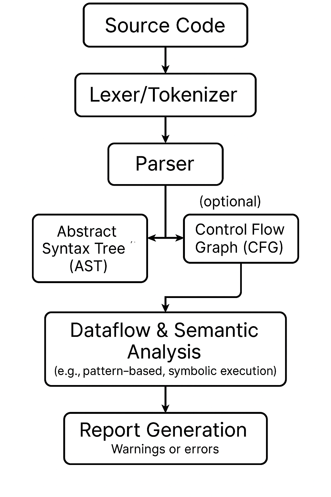

# The Code Detectives: Static Analysis in Dart

## Introduction: Meet Our Code Detectives

Ppt leaned back in his chair, running his hands through his hair in frustration. "I've been debugging this issue for hours! The code compiles fine, but something keeps going wrong in production."

Ragib, his mentor and senior developer, smiled knowingly. "Sounds like you might need a better detective on the case. Have you fully utilized static analysis yet?"

"Static what?" Ppt asked.

"Static analysis," Ragib explained. "Think of it as having a meticulous detective examining your code before it ever runs, catching potential issues and enforcing best practices."

## What is Static Analysis and Why You Need It

"Let me show you a real example," Ragib said, pointing to Ppt's screen. "See this line? `if (userType = 'admin') { ... }`"

Ppt nodded. "That's checking if the user is an admin."

"Actually, it's not checking anything—it's assigning 'admin' to userType," Ragib explained. "You wanted `==` for comparison, not `=` for assignment. This is the kind of silent saboteur that static analysis catches for you."

"That's a simple mistake that could cause major issues," Ppt realized. "But how does static analysis actually work?"

"Imagine a detective who knows all the rules of proper Dart code," Ragib began. "This detective—our static analyzer—reads your code without executing it, builds a mental model of what it does, and checks for patterns that might indicate bugs or poor practices."

## How Static Analysis Works

<div style="display: flex; gap: 15px; align-items: flex-start;">

<div style="flex: 1; text-align: center;">
  
  <br/>
  <em>Fig: Simple Static Analysis Flowchart </em>
</div>

<div style="flex: 1; text-align: center;">
  
  <br/>
  <em>Fig: Static Analysis Workflow</em>
</div>

</div>

1. **Parse the Code**: The analyzer reads your .dart files and understands their structure.
2. **Build an Abstract Syntax Tree (AST)**: It creates a tree representation of your code.
3. **Semantic Analysis**: It examines types, resolves names, and understands relationships.
4. **Type Checking**: It verifies that types match and operations are valid.
5. **Apply Lint Rules**: It checks code against configured style and best practice rules.
6. **Generate Diagnostics**: It compiles all issues into reportable format.
7. **Report Issues**: It presents problems to the developer through IDE or command line.

"It's like having a code review from the most detail-oriented teammate imaginable," Ragib explained. "One who never gets tired or misses anything."

## The Team Challenge: Maintaining Consistency

Just as Ragib finished his explanation, three more developers joined them in the meeting room. Mashrafi was working on the authentication module, Mehraj was handling the payment processing, and Rafi was developing the analytics dashboard.

"Perfect timing," Ragib said. "We were just discussing static analysis."

"Oh, I've been meaning to talk about that," Mashrafi said. "I noticed everyone's code looks quite different. Mehraj uses a lot of nullable types with the `?` operator, Rafi prefers throwing exceptions, and Ppt tends to use default values. It makes reviewing each other's code more complicated than it should be."

Mehraj nodded. "And I noticed some of us use snake\_case for file names while others use camelCase. It's becoming hard to find files."

"That's exactly why static analysis is even more valuable on team projects," Ragib explained. "When multiple developers are working simultaneously, maintaining consistency and following the same patterns becomes crucial."

Rafi spoke up, "Last week I spent hours trying to understand why a feature wasn't working, only to discover someone had used a non-nullable type where we needed to handle null values. A consistent approach would have prevented that."

"This is where static analysis truly shines," Ragib said. "By configuring our `analysis_options.yaml` file and committing it to our repository, we ensure everyone follows the same standards—no matter who wrote the code or when."

Ppt looked intrigued. "So it's like having a shared rulebook that the entire team agrees to follow?"

"Exactly," Ragib replied. "And the best part? It's automated. The rules are enforced by the tools, not by someone manually checking during code reviews."

## How to Use Static Analysis in Dart

"This sounds useful," Ppt admitted. "How do I start using it?"

"Good news! You already are, to some extent," Ragib smiled. "The Dart SDK comes with built-in analysis capabilities. Your IDE probably shows warnings and errors in real-time. But we can be more intentional about it."

### IDE Integration

Ragib opened VS Code and pointed to the screen. "See these red squiggly lines? That's the analyzer telling you there's an error. The yellow ones are warnings. If you hover over them, you'll get detailed information about the issue."


"And here in the Problems panel, you can see all the issues in one place, organized by file. You can click on an issue to jump right to the problem location in your code."

```terminal
A value of type 'int' can't be assigned to a variable of type 'String'.
Try changing the type of the variable, or casting the right-hand type to 'String'.
```

"Your IDE reads the settings from your project's `analysis_options.yaml` file, so everyone on the team sees the same warnings and errors," Ragib explained.

### Command Line Analysis

Ragib opened a terminal and typed:

```bash
dart analyze
```

"For a Flutter project, you'd use `flutter analyze` instead," he added.

"But what if I want to customize which rules to enforce?" Ppt asked.

"That's where `analysis_options.yaml` comes in," Ragib replied, creating a new file at the root of Ppt's project:

```yaml
# analysis_options.yaml
include: package:lints/recommended.yaml

analyzer:
  exclude:
    - 'build/**'
    - '**/*.g.dart'  # Generated files
  
  language:
    strict-casts: true
    strict-raw-types: true

linter:
  rules:
    - always_declare_return_types
    - avoid_print
    - unawaited_futures
```

"This file is your detective's instruction manual," Ragib explained. "The `include` directive adds a set of recommended rules. Then we customize by excluding generated files from analysis, enabling stricter type checking, and adding specific linter rules."

### Popular Lint Packages

"Beyond the basic `package:lints`, there are several popular lint packages that teams can adopt," Ragib continued, opening the browser to show some examples:

1. **very_good_analysis**: Created by Very Good Ventures, it enforces stricter rules for Flutter apps
2. **pedantic**: Originally from Google, provides a stricter set of rules
3. **flutter_lints**: The official Flutter team's lint rules for Flutter projects
4. **effective_dart**: Based on Dart's Effective Dart guidelines

"To use any of these, you'd simply replace the `include` statement in your `analysis_options.yaml`. For example:

```yaml
include: package:very_good_analysis/analysis_options.yaml
```

Mashrafi looked at the configuration. "And we can commit this file to our repository so everyone on the team uses the exact same rules?"

"Absolutely," Ragib confirmed. "Once it's in version control, every team member will have the same static analysis configuration. Your IDE will show warnings based on these shared rules, and your CI/CD pipeline can enforce them during builds."

### Enforcing Static Analysis in CI/CD

"Speaking of CI/CD," Ragib said, "let's set up our pipeline to enforce these rules automatically." He opened the team's GitHub Actions workflow file and added:

```yaml
# .github/workflows/analyze.yml
name: Dart Analysis

on:
  push:
    branches: [ main ]
  pull_request:
    branches: [ main ]

jobs:
  analyze:
    runs-on: ubuntu-latest
    steps:
      - uses: actions/checkout@v3
      - uses: dart-lang/setup-dart@v1
      
      - name: Install dependencies
        run: dart pub get
        
      - name: Analyze code
        run: dart analyze --fatal-infos
```

"With this workflow, every pull request and push to main will be checked against our static analysis rules. If the analysis fails, the build fails, preventing problematic code from being merged."

"For Flutter projects," Ragib added, "you'd use `flutter analyze --fatal-infos` instead."

Ppt nodded. "So this ensures that even if someone forgets to run the analyzer locally, or ignores the warnings, they can't merge code that violates our standards?"

"Exactly," Ragib replied. "It's an automated gatekeeper for code quality."

## Suppressing Lint Rules

"But what if there's a legitimate reason to break a rule?" Mehraj asked. "Sometimes we need to do something unusual for a specific case."

"Great question," Ragib answered. "There are two main ways to suppress lint rules temporarily:

### 1. Line-Level Suppression

```dart
// ignore: avoid_print
print('This print statement is necessary for debugging');
```

### 2. File-Level Suppression

```dart
// ignore_for_file: avoid_print, unnecessary_this
```

"However," Ragib cautioned, "these should be used sparingly and with good reason. Each suppression should ideally include a comment explaining why the rule is being ignored."

"When is it appropriate to use suppressions?" Ppt asked.

"Generally, only when:

1. The rule doesn't apply in this specific context
2. Following the rule would make the code less readable or maintainable
3. You're dealing with generated code that you can't modify
4. You're working with a legacy codebase during transition

"It's almost always better to fix the issue than to suppress the warning," Ragib emphasized. "Suppressions should be the exception, not the rule."

Mehraj nodded in understanding. "So we should document why we're ignoring the rule, not just suppress it silently."

"Precisely," Ragib confirmed.

## Understanding Linter Rules

"What exactly are 'linter rules'?" Ppt asked.

"Linter rules are specific patterns the analyzer looks for," Ragib explained. "They generally fall into three categories:

1. **Error Rules**: These catch likely bugs, like `unawaited_futures` which flags when you forget to await a Future.
2. **Style Rules**: These enforce consistent coding style, like `camel_case_types` ensuring class names use camelCase.
3. **Pub Rules**: These check package-related conventions, like `secure_pubspec_urls` ensuring URLs use HTTPS."

Ragib opened a browser and showed the team the official Dart linter rules documentation. "There are over 150 built-in rules! But don't worry, you don't need to enable them all manually. That's why we included `package:lints/recommended.yaml` earlier—it's a curated set of rules that works well for most projects."

## Built-in Linter Rules: Some Practical Examples

"Let me show you some particularly useful built-in rules with examples," Ragib offered.

```dart
// Rule: unawaited_futures
void problematic() async {
  doSomethingAsync(); // Oops, forgot to await!
  print('Done!'); // This might run before the async operation finishes
}

void fixed() async {
  await doSomethingAsync();
  print('Now truly done!');
}

// Rule: prefer_final_fields
class Bad {
  String name; // Mutable field
  Bad(this.name);
}

class Good {
  final String name; // Immutable field, can't be changed after initialization
  Good(this.name);
}

// Rule: avoid_print
void logging() {
  print('Error occurred!'); // Problematic for production code
  
  // Better:
  logger.error('Error occurred!'); // Using a proper logging system
}
```

The team nodded in understanding.

Mashrafi spoke up, "It's like we're establishing a shared language for our code. When everyone follows the same patterns, we can focus on functionality rather than form."

"Exactly," Ragib replied. "And this consistency becomes even more important as our team grows or when new developers join the project."

"But what if our team has specific conventions that aren't covered by built-in rules?" Ppt asked.

## Creating Custom Lint Rules

"That's where custom lint rules come in," Ragib said. "Let me show you how to create one that enforces our team's specific conventions."

"Imagine our team has decided that all service classes must end with 'Service' in their name. We can enforce this automatically."

Ragib created a new directory structure:

```dart
team_lints/
  pubspec.yaml
  lib/
    team_lints.dart
    src/
      enforce_service_suffix_rule.dart
```

"First, let's set up the package," he said, creating the `pubspec.yaml`:

```yaml
name: team_lints
environment:
  sdk: ">=3.0.0 <4.0.0"

dependencies:
  analyzer: ^6.0.0
  analyzer_plugin: ^0.11.0
  custom_lint_builder: ^0.6.0
```

Next, he created the main entry point `lib/team_lints.dart`:

```dart
import 'package:custom_lint_builder/custom_lint_builder.dart';
import 'src/enforce_service_suffix_rule.dart';

PluginBase createPlugin() => _TeamProjectLinter();

class _TeamProjectLinter extends PluginBase {
  @override
  List<LintRule> getLintRules(CustomLintConfigs configs) => [
        EnforceServiceSuffixRule(),
      ];
}
```

Finally, he implemented the rule in `lib/src/enforce_service_suffix_rule.dart`:

```dart
import 'package:analyzer/error/listener.dart';
import 'package:analyzer/dart/ast/ast.dart';
import 'package:custom_lint_builder/custom_lint_builder.dart';

class EnforceServiceSuffixRule extends DartLintRule {
  EnforceServiceSuffixRule() : super(code: _code);

  static const _code = LintCode(
    name: 'enforce_service_suffix',
    problemMessage: 'Service classes should end with the "Service" suffix.',
    correctionMessage: 'Rename the class to end with "Service" for consistency.',
    errorSeverity: ErrorSeverity.WARNING,
  );

  @override
  void run(
    CustomLintResolver resolver,
    ErrorReporter reporter,
    CustomLintContext context,
  ) {
    context.registry.addClassDeclaration((node) {
      final className = node.name.lexeme;
      
      // Check if class has "Service" in the name but doesn't end with it
      if (className.contains('Service') && !className.endsWith('Service')) {
        reporter.reportErrorForToken(_code, node.name);
      }
    });
  }
}
```

"Now we need to integrate this with our main project," Ragib explained, updating the main project's `pubspec.yaml`:

```yaml
dev_dependencies:
  custom_lint: ^0.6.0
  team_lints:
    path: ../team_lints
```

And the main project's `analysis_options.yaml`:

```yaml
analyzer:
  plugins:
    - custom_lint
```

"With this setup," Ragib concluded, "any class with 'Service' in its name that doesn't end with 'Service' will trigger a warning. For example, `UserServiceManager` would be flagged, suggesting it should be renamed to `UserManagerService`."

Rafi was impressed. "This means we can encode our team's specific conventions directly into the tooling!"

"Exactly," Ragib replied. "And once this is set up, new team members will automatically learn our conventions through the immediate feedback they get from the analyzer."

"This solves our architecture drift problem too," Mehraj noted. "Remember how our repository structure started clean but gradually became inconsistent as different people added new features?"

"With custom lints, we can enforce architectural boundaries and naming conventions across the entire team, automatically," Mashrafi added.

## Putting It All Together

Ppt was convinced. "This is like having a tireless code reviewer that catches mistakes before they cause problems and helps maintain consistency across the team."

"Exactly," Ragib nodded. "Static analysis is one of the most powerful tools for maintaining code quality, especially in team settings. It catches bugs early, enforces consistent style, and reduces the cognitive load during code reviews."

"Instead of debating formatting or naming conventions in pull requests, you can focus on logic and architecture," Rafi said.

"And it creates a shared language for the team," Mashrafi added. "When everyone follows the same patterns, the codebase feels coherent even with multiple authors."

"Plus, it reduces onboarding time for new team members," Mehraj pointed out. "The tools guide them toward our team's established practices automatically."

Ppt started exploring his code with new eyes. "I see several places where I could improve based on the analyzer's suggestions."

"That's the spirit!" Ragib smiled. "Remember, static analysis isn't about blindly following rules—it's about understanding why those rules exist and using them to write better code that's consistent across the team."

As the team left the meeting, they had a shared understanding that static analysis wasn't just a tool for individual developers—it was the foundation of their collective coding standards, ensuring that no matter who wrote which part of the codebase, it would all fit together seamlessly.

## Key Takeaways

1. **Static analysis** examines your code without running it, identifying potential bugs and enforcing best practices.
2. **Team consistency** is dramatically improved when all developers follow the same rules enforced by automated tools.
3. **Built-in to Dart** via the `dart analyze` command and IDE integration.
4. **Customizable** through the `analysis_options.yaml` file, which can be committed to version control.
5. **Linter rules** come in three main categories: error rules, style rules, and pub rules.
6. **Custom lint rules** can enforce team-specific conventions through a separate package.
7. **Continuous feedback** helps developers learn and improve their code quality over time.
8. **Reduced onboarding time** for new team members who learn conventions automatically.
9. **CI/CD integration** ensures nobody can merge code that doesn't pass static analysis.
10. **Multiple lint packages** provide different levels of strictness for different team needs.

With static analysis as your detective, your team's code will be cleaner, more maintainable, and less error-prone—a true win for any development project.
